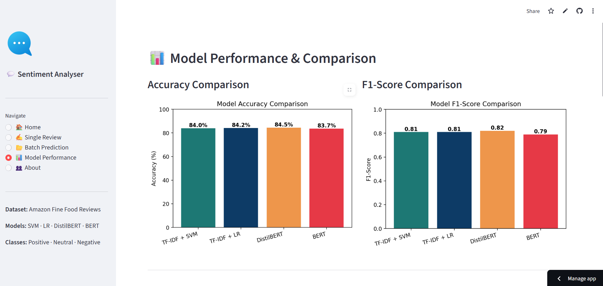
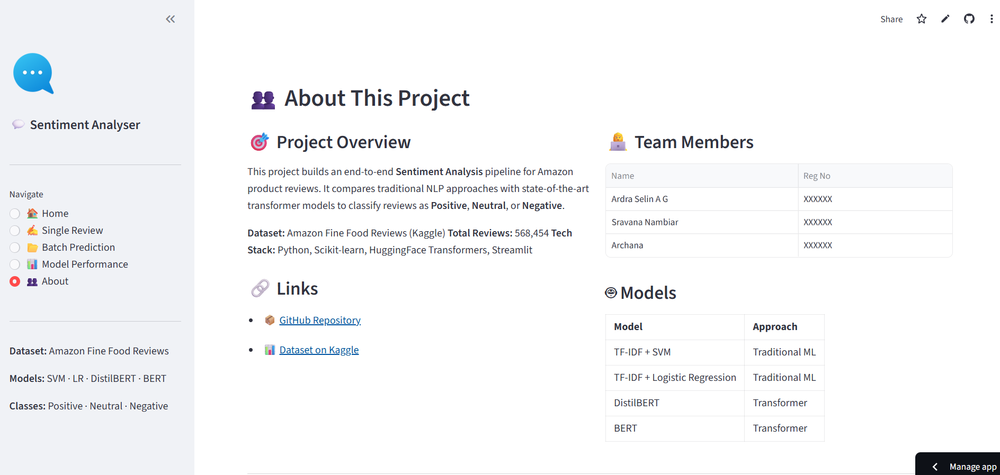

# Project Title: Sentiment Analysis of Product Reviews

## Team Members

| Name | Reg No | Course |
| --- | --- | --- |
| Ardra Selin A G | 253006 | MSc. COMPUTER SCIENCE WITH SPECIALIZATION IN DATA ANALYTICS |
| Sravana Nambiar | 253212 | MSc. DATA SCIENCE AND BIO AI |
| Archana T | 253205 | MSc. DATA SCIENCE AND BIO AI |

---

## 👥 Team

| Member | Role |
|--------|------|
| Ardra Selin A G | Spearheaded the end-to-end development and delivery of the project. Established the complete repository architecture including all directory components (code/, models/, reports/, results/, Data/). Designed and deployed the full Streamlit web application featuring 5 pages — Home, Single Review Prediction, Batch Prediction, Model Performance, and About. Trained and benchmarked all 4 models (TF-IDF+SVM, TF-IDF+LR, DistilBERT, BERT), achieving a peak accuracy of 84.50% with DistilBERT. Authored detailed README.md, Contributing.md, Project_Summary.md, and .gitignore files. Added classification reports, application screenshots, and sample dataset files. Implemented cloud-based model hosting via Google Drive for deployment. |
| Sravana Nambiar | Carried out data preprocessing and cleaning to enhance dataset quality and readiness for model training. Successfully deployed the application via Streamlit for interactive predictions and accessible user experience. Contributed to repository management and README documentation updates. Executed preprocessing tasks including handling of missing values, feature preparation, and data transformation. Developed and deployed the project interface using Streamlit and assisted in maintaining the GitHub repository along with project documentation. Worked on dataset preprocessing and prepared the end-to-end project pipeline for deployment. Integrated the trained model into a Streamlit web application and contributed to updating project files such as README.md and requirements.txt. Supported project development by performing preprocessing, organizing the repository structure, and deploying the machine learning application using Streamlit. Also helped enhance project documentation and setup instructions to facilitate easier collaboration. |
| Archana T | Contributed to the machine learning pipeline by training, evaluating, and benchmarking all four models — TF-IDF+SVM, TF-IDF+Logistic Regression, DistilBERT, and BERT — to analyze model performance and optimize prediction accuracy. Successfully generated and integrated the `model.pkl` file for deployment and real-time prediction use cases. Managed project dependencies by creating and maintaining the `requirements.txt` file to ensure reproducibility and seamless environment configuration across systems. Contributed to improving project documentation by updating the `README.md` with detailed project information, installation steps, usage guidelines, and workflow explanations to support collaboration and project comprehension. |

---

## Problem Statement

Sentiment Analysis has emerged as one of the most impactful applications of Natural Language Processing (NLP) in today's data-rich digital landscape. Daily, millions of users share their opinions, experiences, and feedback through online reviews on e-commerce platforms, social media, and discussion forums. For organizations, these reviews contain critical insights about customer satisfaction, product quality, service delivery, and overall user experience. However, manually processing such a vast volume of textual data is time-consuming, resource-intensive, and largely impractical at scale. This establishes a clear need for intelligent automated systems capable of understanding and classifying customer opinions accurately and efficiently.

This project focuses on building an advanced Sentiment Analysis system for product reviews using the **Amazon Fine Food Reviews** dataset. The system is designed to automatically categorize customer reviews into three sentiment classes: **Positive**, **Neutral**, and **Negative**. By leveraging both classical machine learning techniques and modern transformer-based deep learning architectures, the project aims to compare different NLP methodologies and determine the most effective approach for sentiment classification tasks.

The project begins with comprehensive data preprocessing and text cleaning to transform raw textual data into a structured, model-ready format. Since real-world review datasets often contain noise such as punctuation artifacts, stopwords, HTML tags, emojis, repeated characters, and inconsistent formatting, preprocessing is a critical step for improving model accuracy. Various NLP techniques including tokenization, lowercasing, stopword removal, stemming, and lemmatization are applied to prepare the dataset for analysis and feature extraction.

Beyond preprocessing, the project includes thorough Exploratory Data Analysis (EDA) to better understand the distribution and properties of the dataset. EDA helps surface meaningful patterns such as sentiment distribution, high-frequency words, review length trends, and customer behavior insights. Visualization tools including bar plots, word clouds, frequency distributions, and sentiment comparisons are used to extract actionable understanding from the data prior to model development.

The project implements and compares both traditional and modern NLP models. Traditional machine learning approaches such as **TF-IDF + Support Vector Machine (SVM)** and **TF-IDF + Logistic Regression (LR)** serve as baseline models due to their simplicity, computational efficiency, and strong performance on text classification tasks. Alongside these, state-of-the-art transformer architectures including **BERT (Bidirectional Encoder Representations from Transformers)** and **DistilBERT** are trained and evaluated to harness contextual language understanding and deep semantic representation capabilities.

Transformer-based models have considerably advanced NLP benchmarks in recent years owing to their ability to capture contextual relationships between words in a sequence. By comparing classical feature-engineering approaches with transformer-based deep learning models, the project delivers a comprehensive evaluation of how different methodologies perform on sentiment classification tasks involving real-world customer review data.

The complete workflow adheres to a structured data science and machine learning pipeline, comprising:

* Data collection and dataset preparation
* Data preprocessing and text normalization
* Exploratory Data Analysis (EDA)
* Feature extraction using TF-IDF and transformer-based embeddings
* Model training and hyperparameter optimization
* Performance evaluation and comparative analysis
* Deployment preparation for real-time predictions

All models are evaluated using multiple classification metrics including **accuracy, precision, recall, F1-score, and confusion matrices** to ensure reliable and unbiased comparison. The ultimate goal of this project is to identify the most accurate and computationally efficient sentiment analysis model that can be deployed for automated review classification and customer feedback analysis in production environments.

---

## Objectives

* Develop an automated Sentiment Analysis pipeline capable of classifying product reviews into **Positive**, **Neutral**, and **Negative** sentiment categories.
* Perform comprehensive data preprocessing and text cleaning to improve the quality and consistency of textual data before model training.
* Conduct thorough Exploratory Data Analysis (EDA) to uncover trends, patterns, and sentiment distributions within the dataset.
* Apply Natural Language Processing techniques such as tokenization, stopword removal, stemming, and lemmatization for effective text normalization.
* Extract meaningful textual features using both classical approaches like **TF-IDF** and advanced contextual embeddings from transformer-based models.
* Build and compare classical machine learning models including **TF-IDF + Support Vector Machine (SVM)** and **TF-IDF + Logistic Regression (LR)**.
* Train and evaluate modern transformer-based deep learning models such as **BERT** and **DistilBERT** for sentiment classification.
* Compare the performance of all models using evaluation metrics including **accuracy, precision, recall, F1-score, and confusion matrices**.
* Identify the best-performing model based on classification accuracy, computational efficiency, and generalization capability.
* Prepare the trained model for deployment and real-time sentiment prediction applications.
* Demonstrate the applicability of NLP and deep learning techniques to large-scale, real-world business problems centered on customer feedback analysis.

---

## Dataset

- **Source:** Amazon Fine Food Reviews (via Kaggle)
- The dataset contains **568,454 reviews** from Amazon spanning more than 10 years

### Dataset Link

- https://www.kaggle.com/datasets/snap/amazon-fine-food-reviews

### Key Columns

- `Text` — Complete review text
- `Summary` — Short review headline
- `Score` — Star rating (1–5, mapped to sentiment labels)

### Sentiment Mapping

| Score | Sentiment |
| --- | --- |
| 4–5 stars | Positive |
| 3 stars | Neutral |
| 1–2 stars | Negative |

---

## Methodology

### 1. Data Preprocessing

- Removed duplicate and null entries
- Mapped star ratings to sentiment labels (Positive / Neutral / Negative)
- Lowercased text; removed HTML tags, punctuation, and stopwords
- Applied lemmatization for word normalization
- Addressed class imbalance through stratified sampling

---

### 2. Exploratory Data Analysis (EDA)

- Visualized sentiment class distribution
- Generated word clouds per sentiment category
- Analyzed review length distributions
- Identified most frequently occurring words per sentiment class

---

### 3. Feature Engineering

- **TF-IDF Vectorization** for classical ML models (top N-gram features)
- **BERT / DistilBERT tokenization** for transformer-based models
- Train-test split (80/20) with stratification to maintain class balance

---

### 4. Model Building

The following models were implemented and evaluated:

- TF-IDF + Support Vector Machine (SVM)
- TF-IDF + Logistic Regression
- DistilBERT (fine-tuned)
- BERT (fine-tuned)

---

### 5. Model Evaluation

Models were assessed using:

- Accuracy
- Precision
- Recall
- F1-score
- Confusion Matrix

---

## Results & Comparison

| Model | Accuracy | F1-Score |
| --- | --- | --- |
| TF-IDF + SVM | 83.97% | 0.81 |
| TF-IDF + Logistic Regression | 84.15% | 0.81 |
| DistilBERT | 84.50% | 0.82 |
| BERT | 83.70% | 0.79 |

**Best Model: DistilBERT with 84.50% accuracy and F1-score of 0.82** 🏆

---

## Model Performance Summary

### TF-IDF + SVM
1. **Accuracy:** 83.97%
2. **F1-Score:** 0.81
3. **Strengths:** Rapid training, performs reliably on high-dimensional sparse text feature spaces.

### TF-IDF + Logistic Regression
1. **Accuracy:** 84.15%
2. **F1-Score:** 0.81
3. **Strengths:** Highly interpretable, serves as a strong and reliable baseline for text classification tasks.

### DistilBERT
1. **Accuracy:** 84.50%
2. **F1-Score:** 0.82
3. **Strengths:** Lightweight transformer retaining ~97% of BERT's performance at 60% of the model size. Effectively captures contextual word meaning and semantic nuance.

### BERT
1. **Accuracy:** 83.70%
2. **F1-Score:** 0.79
3. **Strengths:** Provides state-of-the-art contextual embeddings with superior capacity for understanding nuanced and complex language patterns in reviews.

---

## Evaluation Matrix

Classification reports for each model are available in `reports/classification_report/` for detailed per-class performance analysis.

---

## Conclusion

This project successfully builds a Sentiment Analysis pipeline capable of classifying Amazon product reviews into three sentiment categories. By contrasting traditional machine learning approaches (SVM, Logistic Regression) with state-of-the-art transformer-based models (BERT, DistilBERT), the project demonstrates the trade-offs between training speed, model interpretability, and classification accuracy in NLP applications. The complete pipeline — spanning data preprocessing, EDA, model development, and evaluation — serves as a thorough and practical example of the NLP project lifecycle applied to a real-world business problem.

---

## Repository Structure

```
Sentiment_Analysis_of_Product_Reviews/
│
├── Data/                          # Dataset information and links
├── code/                          # Jupyter notebooks
│   └── sentiment_analysis.ipynb
├── models/                        # Saved model files (.pkl, .pt)
├── reports/
│   └── classification_report/     # Per-model classification reports
├── results/
│   └── plots/                     # Output visualizations
├── README.md
├── Contributing.md
├── Project_Summary.md
├── Requirements.txt
└── .gitignore
```

---

## Application Screenshots

### Home Page


### Single Review Prediction


### Model Performance


### Metrics Summary


### About Page


---

## Live Application

🚀 **Streamlit App:**
[Sentiment Analysis App](https://sentimentanalysisofappuctreviews-ibsbwdzbzrapjcmypchsse.streamlit.app/)
