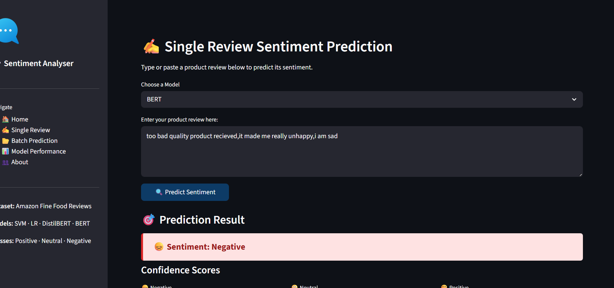
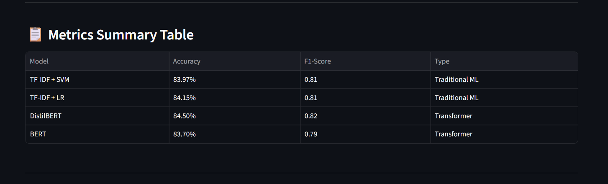

# Project Title: Sentiment Analysis of Product Reviews
Deployed app : https://sentimentanalysisofappuctreviews-ibsbwdzbzrapjcmypchsse.streamlit.app/
## Team Members

| Name | Reg No |
| --- | --- |
| Ardra Selin A G | 253006 |
| Sravana Nambiar | 253212 |
| Archana T | 253205 |

---

## Problem Statement

Sentiment Analysis of product reviews is a critical Natural Language Processing (NLP) task that helps businesses understand customer opinions at scale. With the explosion of online reviews on platforms like Amazon, manually reading and categorizing feedback is impractical. This project aims to build a robust system that can automatically classify product reviews as **Positive**, **Neutral**, or **Negative** using machine learning and deep learning techniques.

The project uses the **Amazon Fine Food Reviews** dataset and applies both traditional ML approaches (TF-IDF + SVM, TF-IDF + Logistic Regression) and state-of-the-art transformer models (BERT, DistilBERT) to compare performance across different methodologies.

The project follows the complete data science lifecycle, including:

- Data preprocessing and text cleaning
- Exploratory Data Analysis (EDA)
- Feature extraction (TF-IDF, BERT embeddings)
- Model development and comparison
- Evaluation using classification metrics

---

## Objectives

- Classify product reviews into Positive, Neutral, and Negative sentiments
- Perform comprehensive text preprocessing and exploratory data analysis
- Build and compare traditional ML models with transformer-based deep learning models
- Identify the best-performing model based on accuracy and F1-score
- Evaluate models using precision, recall, F1-score, and confusion matrices

---

## Dataset

- **Source:** Amazon Fine Food Reviews (via Kaggle)
- The dataset contains **568,454 reviews** from Amazon spanning over 10 years

### Dataset Link

- https://www.kaggle.com/datasets/snap/amazon-fine-food-reviews

### Key Columns

- `Text` — Full review text
- `Summary` — Short review summary
- `Score` — Rating (1–5 stars, mapped to sentiment)

### Sentiment Mapping

| Score | Sentiment |
| --- | --- |
| 4–5 stars | Positive |
| 3 stars | Neutral |
| 1–2 stars | Negative |

---

## Methodology

### 1. Data Preprocessing

- Removed duplicate and null entries
- Mapped star ratings to sentiment labels (Positive / Neutral / Negative)
- Lowercased text, removed HTML tags, punctuation, and stopwords
- Applied lemmatization for word normalization
- Handled class imbalance via stratified sampling

---

### 2. Exploratory Data Analysis (EDA)

- Visualized sentiment class distribution
- Generated word clouds for each sentiment category
- Analysed review length distributions
- Identified most frequent words per sentiment class

---

### 3. Feature Engineering

- **TF-IDF Vectorization** for traditional ML models (top N-gram features)
- **BERT / DistilBERT tokenization** for transformer-based models
- Train-test split (80/20) with stratification

---

### 4. Model Building

The following models were implemented:

- TF-IDF + Support Vector Machine (SVM)
- TF-IDF + Logistic Regression
- DistilBERT (fine-tuned)
- BERT (fine-tuned)

---

### 5. Model Evaluation

Models were evaluated using:

- Accuracy
- Precision
- Recall
- F1-score
- Confusion Matrix

---

## Results & Comparison

| Model | Accuracy |
| --- | --- |
| TF-IDF + SVM | 83.97% |
| TF-IDF + Logistic Regression | 84.15% |
| DistilBERT | 84.50% |
| BERT | 83.70% |

## Results & Comparison

| Model | Accuracy | F1-Score |
| --- | --- | --- |
| TF-IDF + SVM | 83.97% | 0.81 |
| TF-IDF + Logistic Regression | 84.15% | 0.81 |
| DistilBERT | 84.50% | 0.82 |
| BERT | 83.70% | 0.79 |

**Best Model: DistilBERT with 84.50% accuracy and F1-score of 0.82** 🏆

---

## Model Performance Summary

### TF-IDF + SVM
1. **Accuracy:** 83.97%
2. **F1-Score:** 0.81
3. **Strengths:** Fast training, works well with high-dimensional sparse text features.

### TF-IDF + Logistic Regression
1. **Accuracy:** 84.15%
2. **F1-Score:** 0.81
3. **Strengths:** Highly interpretable, stro

> ⚠️ Results to be updated after model training is complete.

---

## Model Performance Summary

### TF-IDF + SVM

1. **Accuracy:** TBD
2. **Strengths:** Fast training, works well with high-dimensional sparse text features.
3. **Precision/Recall/F1:** TBD

### TF-IDF + Logistic Regression

1. **Accuracy:** TBD
2. **Strengths:** Highly interpretable, strong baseline for text classification tasks.
3. **Precision/Recall/F1:** TBD

### DistilBERT

1. **Accuracy:** TBD
2. **Strengths:** Lightweight transformer that retains ~97% of BERT's performance at 60% of the size. Captures contextual word meaning.
3. **Precision/Recall/F1:** TBD

### BERT

1. **Accuracy:** TBD
2. **Strengths:** State-of-the-art contextual embeddings. Best at understanding nuanced language in reviews.
3. **Precision/Recall/F1:** TBD

---

## Evaluation Matrix

Classification reports for each model will be added to `reports/classification_report/` once training is complete.

---

## Conclusion

This project develops a Sentiment Analysis system capable of classifying Amazon product reviews into three sentiment categories. By comparing traditional ML approaches (SVM, Logistic Regression) with modern transformer-based models (BERT, DistilBERT), we aim to demonstrate the trade-offs between speed, interpretability, and accuracy in NLP tasks. The complete pipeline covers data preprocessing, EDA, model development, and evaluation — serving as a comprehensive example of an NLP project lifecycle.

---

## Repository Structure

```
Sentiment_Analysis_of_Product_Reviews/
│
├── Data/                          # Dataset info and links
├── code/                          # Jupyter notebooks
│   └── sentiment_analysis.ipynb
├── models/                        # Saved model files (.pkl, .pt)
├── reports/
│   └── classification_report/     # Per-model classification reports
├── results/
│   └── plots/                     # Output visualizations
├── README.md
├── Contributing.md
├── Project_Summary.md
├── Requirements.txt
└── .gitignore
```
## Application Screenshots

### Home Page


### Single Review Prediction


### Model Performance


### Metrics Summary


### About Page

